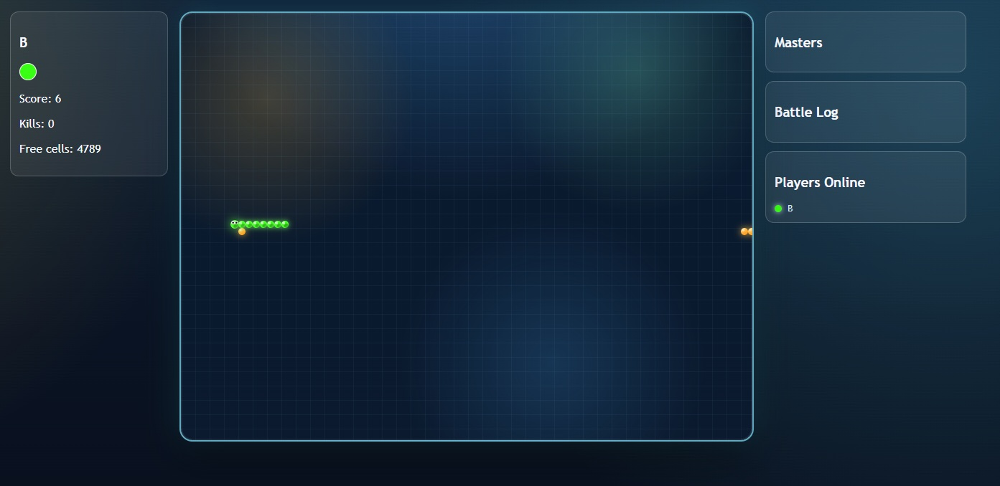

# ZNK Snake Multiplayer

Jogo Snake multiplayer em tempo real com foco em competicao por sobrevivencia, eliminacoes e vitoria por ciclo.

## Preview

Imagem atual usada do projeto em `docs/images/jogoBanner.jpg`.



## Sobre o projeto

Este projeto implementa uma arena Snake com:

- lobby com entrada de jogador e selecao de cor
- sincronizacao de estado em tempo real via sockets
- colisao entre cobras (parede, self, corpo inimigo, head-to-head)
- respawn com cooldown
- ciclo de vitoria com regra oficial de free cells
- ranking de mestres por ciclo

## Tecnologias usadas

### Frontend

- React (TypeScript)
- Vite
- CSS global customizado (tema neon/arcade)
- Socket.IO Client

### Backend

- Node.js + TypeScript
- Express
- Socket.IO
- Arquitetura por servicos (GameService, SnakeService, FoodService, etc.)

### Shared contract

- pacote `shared` com tipos e contratos de eventos Socket para cliente e servidor

### Qualidade

- Vitest para testes unitarios e de contrato
- testes de integracao no workspace

## Estrutura principal

```text
client/   -> interface, contexto de jogo, hooks e componentes visuais
server/   -> logica de jogo, regras, sockets e estado autoritativo
shared/   -> tipos e eventos compartilhados
specs/    -> especificacao, plano e tarefas do projeto (Spec Kit)
```

## Spec Kit no projeto

Este jogo foi guiado por Spec Kit dentro da pasta `specs/001-znk-snake-multiplayer`.

### Como foi usado

- `spec.md`: requisitos funcionais e criterios de aceitacao
- `plan.md`: desenho tecnico e estrategia de implementacao
- `tasks.md`: backlog tecnico em ordem de execucao
- `research.md`, `data-model.md`, `contracts/`: apoio de arquitetura e contratos

### Vantagens do Spec Kit

- clareza de escopo antes de codar
- menor risco de retrabalho
- rastreabilidade entre requisito, implementacao e teste
- backlog objetivo para execucao por fases
- onboarding mais rapido para novos contribuidores

## Como rodar localmente

### 1) Instalar dependencias

```bash
yarn install
```

### 2) Rodar frontend e backend

Em terminais separados:

```bash
yarn workspace server dev
```

```bash
yarn workspace client dev
```

### 3) Rodar testes

```bash
yarn workspace server test
```

## Observacoes

- O servidor e autoritativo para estado e regras de colisao.
- O cliente renderiza o estado recebido e envia intents (move, respawn, etc.).
- O cooldown de respawn evita respawns em sequencia imediata.
